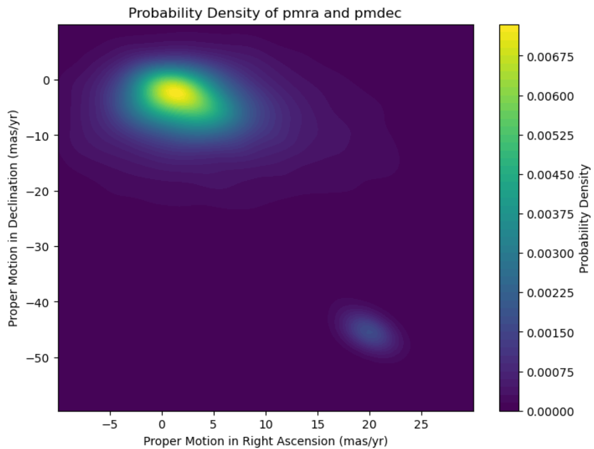
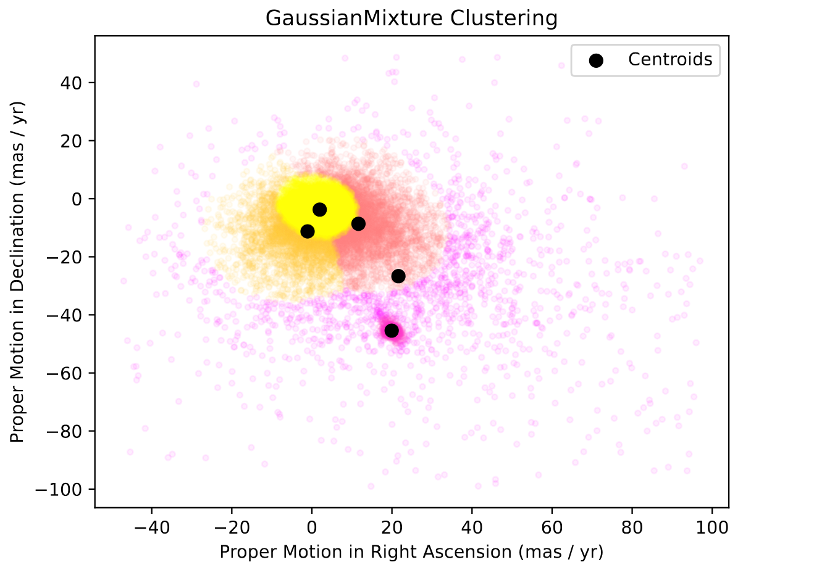

# Clustering and PCA on Gaia Telescope Data

This project applies unsupervised learning techniques to Gaia space telescope data to identify stellar groupings and analyze their physical characteristics. It explores the effectiveness of K-means and Gaussian Mixture Models (GMMs) for clustering, and uses Principal Component Analysis (PCA) to reduce dimensionality and interpret astrophysical features.

Originally developed as an academic exercise, this work demonstrates data filtering, feature scaling, model selection, and astrophysical visualization using real astronomical data.

## Project Outcomes

- Filtered Gaia star data to remove noise and outliers
- Performed clustering with K-means and GMMs
- Used Gaussian KDE to identify low-density stellar structures
- Applied PCA to identify key features and reduce dimensionality
- Visualized stellar populations in a Hertzsprung–Russell diagram

## Report

A full report with method, results, and analysis is here:  
[`Sarah_Straw_Report.pdf`](./Report.pdf)

## Skills 

- Unsupervised machine learning
- Dimensionality reduction (PCA)
- Probability density estimation (Gaussian and KDE)
- Feature scaling and preprocessing
- Scientific plotting and astrophysical features interpretation

## Images Outputs

All image outputs can be found in the jupyter notebook here: [`full code`](./main.ipynb)

  
  
  
  
  

## Requirements

 - Python 3
 - numpy
 - pandas
 - matplotlib
 - seaborn
 - scikit-learn
